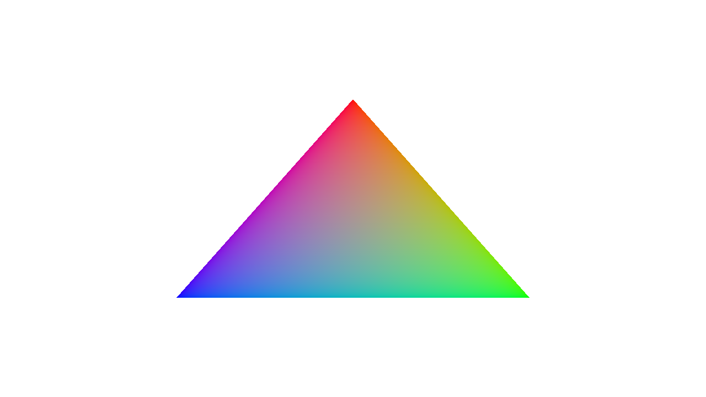

# Vulkan Triangle Issues Challenge
Making a triangle is easy with Vulkan... right? 

In this challenge, you will have to fix a Vulkan program that aims to draw a triangle on screen.

1 point if you can make the triangle appear.

1 more point if you can make it appear exactly the same way as the reference image below (the outer transparency does not count).

100 more points if you can fix all the validation warnings and errors.

## Reference


## Build
### Windows
Use CMake to generate a Visual Studio solution in a newly created ``build`` directory.

### Linux
```bash
mkdir build
cd build
cmake ..
make -j
```